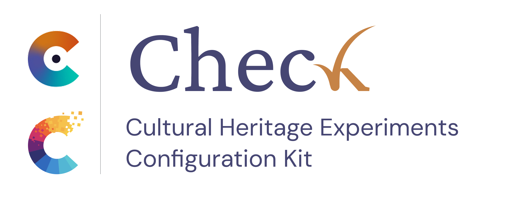

# Cultural Heritage Expeirments Configuration Kit (checK)

This repository contains the material of **checK** (Cultural Heritage Experiment Configuration Kit), an ATON-based web app to costumise experiments on 3D cultural heritage environment designed and developed by CNR ISPC, DHILab - Florence.

1. Clone the ATON flare for checK ("[check-flare](https://github.com/cnr-ispc-dhilab-fi/check-flare)") in `[your main aton instance]/config/flares/`;
2. Clone this repository in `[your main aton instance]/webapps/`. See main [ATON Framework repository](https://github.com/phoenixbf/aton);
3. In the folders `data/collections` and  `data/scenes`, add a repository `check-user`; 
4. Open terminal in your main ATON instance and run `npm run deploy-pm2`. You can access the dashboard at `https://localhost:8080/a/check`
 
## Acknowledgment

This project received funding from:
- H2IOSC Project - Humanities and cultural Heritage Italian Open Science Cloud, funded by European Union – NextGenerationEU – NRRP M4C2 - Project code IR0000029 - CUP B63C22000730005;
- PERCEIVE Project - Perceptive Enhanced Realities of Colored collEctions through AI and Virtual Experiences, funded by the European Union under grant agreement Nr. 101061157;
- COLOURS Project - Collaborative On-cloud Lab for the conservation and digital restoration of ColOUred heritage collectionS, funded by the European Union under grant agreement Nr. 101233413;
- CHANGES Foundation - Cultural Heritage Active Innovation for Next Gen Sustainable Society, funded by European Union – NextGenerationEU – NRRP M4C2 - UP B83D22001210006;
- Swiss Government Excellence Scholarship No. 2025.0089.